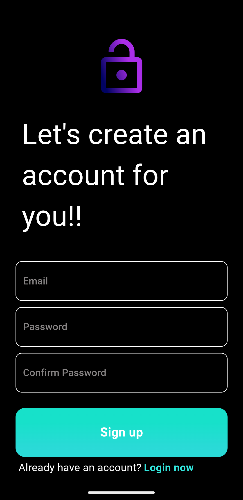
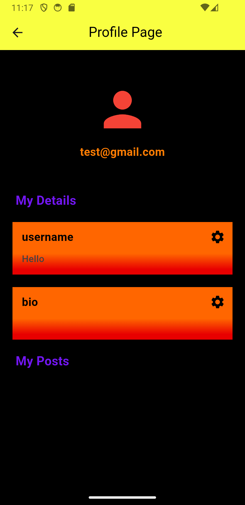

# PULSE SOCIAL
A Flutter application that allows users to Create, Read, Update and Delte posts and allows them to comunicate with each ohter .


##  TABLE OF CONTENTS

- [Installation](#installation)
- [Screenshots](#screenshots)
- [Credits](#credits)


## INSTALLATION

```bash
git clone https://github.com/Harshit-Bhakta/socialmedia_app
cd socialmedia_app
flutter pub get
```

## SCREENSHOTS


| Splash Page | Login Page | Register Page | Home Page | Drawer Slide | Profie Page
| --- | --- | --- | --- | --- | --- | 
|    |  |  |  |  |  |


## CREDITS

- [FLUTTER](https://flutter.dev/)
- [DART](https://dart.dev/)
- [VS CODE](https://code.visualstudio.com/)


